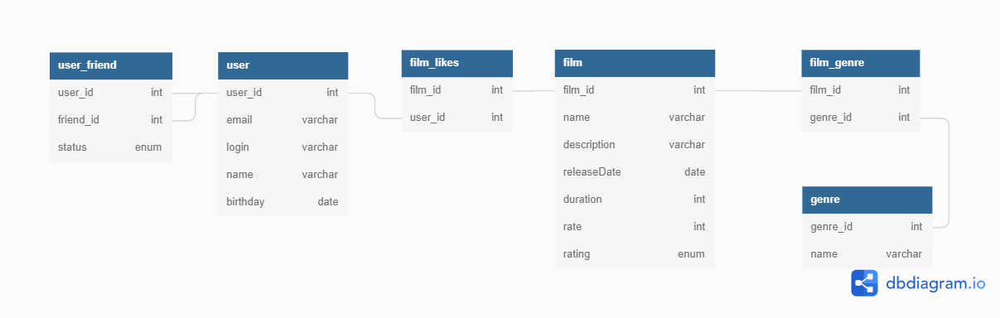

# java-filmorate

##О ER-диаграмме
- Таблица *user* содержит подробную информацию о пользователях.
- Таблица *user_friends* содержит информацию о запросах дружбы у пользователей:
    Столбец *status_id* отсылает на значения "Requested" и "Accepted" в таблице *friendship_status*.
- Таблица *film* содержит подробную информацию о фильмах.
- Таблица *film_likes* содержит информацию о фильмах и пользователях, поставивших и лайк.
- Таблица *film_genre* содержит информацию о фильмах и жанрах, к которым они относятся.

    

